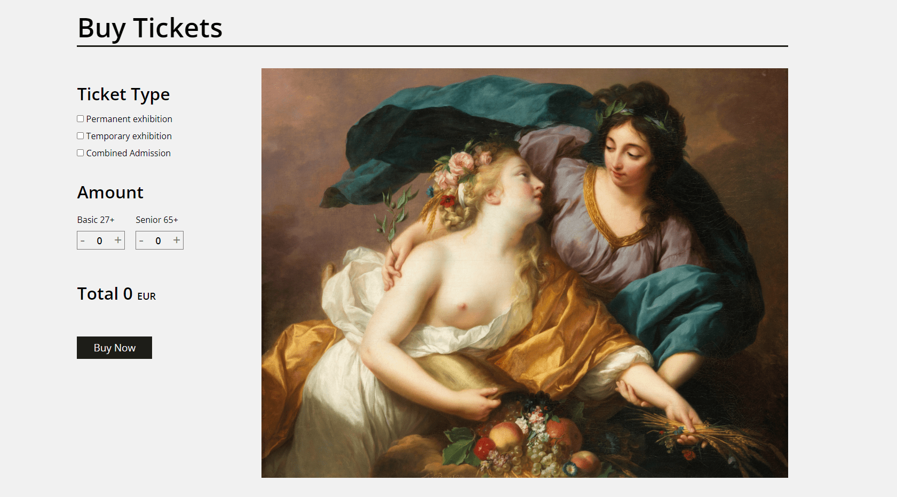

# ⚜️ Louvre Museum


## Front-end project using a third-party API

## ✏️ Description

**Louvre Museum** is a landing page on the theme of the Louvre museum using React.js technologies and the _mapbox_ API. <br/>
Possibility to add or remove tickets and locate the museum on an interactive map.<br/>
Fully responsive application. <br/>
Upload with Vercel.

## ⚡️ Overview



## 🔥 Experience

This Landing Page allowed me to enhance my integration skills on the React.js framework and allowed me to have a first approach to responsive design.

## ⚙️ Techno used

  

## 🔧 Install

```
git clone https://github.com/Greepsu/Louvre-museum
cd louvre-museum
npm start
```

## 💻 Links

Application: https://louvre-museum.vercel.app <br/>
Github: https://github.com/Greepsu/Louvre-museum
